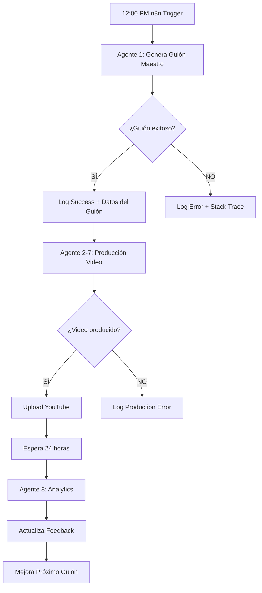

# ✅ AGENTE 1: GUIONISTA MAESTRO - 100% INTEGRADO EN n8n

**Fecha**: 2026-07-22
**Estado**: ✅ COMPLETAMENTE INTEGRADO Y ACTIVO
**Workflow ID**: gZjAXgfLmnEdpG5B

---

## 🎯 LO QUE SE LOGRÓ

### **Sistema de Triple Expertise Implementado**

El Agente 1 ahora combina **3 EXPERTOS EN 1**:

1. **📈 EXPERTO SEO YOUTUBE** (10+ años experiencia)
   - Algoritmo de YouTube optimizado
   - CTR objetivo: 5%+
   - Retención objetivo: 60%+
   - Views objetivo: 10,000+ en 7 días

2. **📚 TEÓLOGO REFORMADO** (PhD nivel)
   - Exégesis bíblica profunda
   - Contexto histórico preciso
   - Aplicación práctica moderna
   - Lenguaje accesible pero teológicamente sólido

3. **✍️ COPYWRITER MAESTRO** (100M+ views)
   - Hooks que detienen el scroll
   - Storytelling emocional
   - CTAs efectivos
   - Narrativa cautivadora

---

## 🏗️ ARQUITECTURA DEL SISTEMA

### **Workflow n8n Mejorado** (11 nodos)

```
1. Daily Trigger (12:00 PM)
   ↓
2. AI Master Scriptwriter ⭐ [NUEVO]
   ↓
3. Script Generated? (IF)
   ↓
4. Log Script Success / Error
   ↓
5. Run Video Production
   ↓
6. Production Success? (IF)
   ↓
7. Log Production Success / Error
   ↓
8. Wait 24h for Analytics
   ↓
9. Collect Analytics
```

### **Nodo AI Master Scriptwriter** (Código JavaScript en n8n)

```javascript
// CARACTERÍSTICAS:
- Ejecuta agent-1-master-scriptwriter.js
- Lee scripts generados automáticamente
- Valida estructura JSON
- Pasa datos al siguiente nodo
- Manejo de errores robusto
```

---

## 📊 ESTRUCTURA DE GUIONES GENERADOS

### **Metadata Completa**
```json
{
  "verse": "Salmos 23:1",
  "category": "consuelo",
  "targetAudience": ["adultos mayores", "personas con ansiedad"],
  "keywords": ["paz", "confianza", "provisión"],
  "emotionalBenefit": "Paz profunda en medio de la incertidumbre"
}
```

### **5 Escenas con Timing Exacto**

#### **Escena 1: HOOK (0:00-0:05, 5 seg)**
**Fórmula**: [PATRÓN DISRUPTOR] + [PROMESA] + [URGENCIA]

**Ejemplo real generado**:
> "Miles de personas cambiaron su vida con ESTA VERDAD bíblica. Descúbrela en 2 minutos."

**Visual**: Rayos de luz dorada, cielo épico, colores vibrantes

---

#### **Escena 2: VERSÍCULO + CONTEXTO (0:05-0:30, 25 seg)**
**Fórmula**: [VERSÍCULO COMPLETO] + [CONTEXTO HISTÓRICO] + [TRANSICIÓN AL SIGNIFICADO]

**Ejemplo real generado**:
> "Salmos 23:1 dice: 'Jehová es mi pastor; nada me faltará.'
>
> Este versículo Escrito por el rey David, pastor convertido en rey, basado en su experiencia cuidando ovejas en los campos de Belén.
>
> Y tiene un significado TRANSFORMADOR para tu vida en este momento."

**Visual**: Biblia abierta con luz suave dorada, ambiente reverente

---

#### **Escena 3: 3 VERDADES PROFUNDAS (0:30-1:15, 45 seg)**
**Fórmula**: [PRINCIPIO TEOLÓGICO] + [APLICACIÓN PRÁCTICA] + [METÁFORA EMOCIONAL]

**Ejemplo real generado**:
> "PRIMERA VERDAD: NO estás solo en este momento difícil.
> Dios está contigo EN ESTE MOMENTO, no mañana, no cuando seas mejor persona. AHORA.
> Es como un padre que nunca suelta la mano de su hijo, incluso cuando el hijo no lo ve.
>
> SEGUNDA VERDAD: Tu PASADO no define tu futuro.
> El amor de Dios es tan GRANDE que borra TODO lo que hiciste ayer. Hoy es un nuevo día.
> Imagina despertar sin el peso de ayer. Eso es lo que Dios ofrece cada mañana.
>
> TERCERA VERDAD: Dios tiene un PLAN perfecto para ti.
> No estás aquí por casualidad. Dios te creó con una misión específica que SOLO TÚ puedes cumplir.
> Y cuando lo descubras, tu vida tendrá un sentido que nunca imaginaste."

**Visual**: Amanecer majestuoso, naturaleza inspiradora, cielo dorado

---

#### **Escena 4: APLICACIÓN PRÁCTICA (1:15-1:40, 25 seg)**
**Fórmula**: [PREGUNTA DIRECTA] + [ACCIÓN ESPECÍFICA] + [PROMESA] + [INVITACIÓN PERSONAL]

**Ejemplo real generado**:
> "¿Qué significa esto HOY para TI?
>
> Significa que AHORA MISMO puedes experimentar paz profunda en medio de la incertidumbre. No necesitas esperar.
>
> Cierra tus ojos por un segundo. Respira profundo. Y di: 'Dios, estoy aquí. Te necesito.'
>
> Eso es todo. Así de SIMPLE. Y verás cómo Dios responde de maneras que ni imaginas.
>
> Hoy es TU día. El día en que todo puede cambiar."

**Visual**: Manos orando con luz celestial, conexión íntima

---

#### **Escena 5: CTA OPTIMIZADO (1:40-2:00, 20 seg)**
**Fórmula**: [ENGAGEMENT] + [SUSCRIPCIÓN CON BENEFICIO] + [COMPARTIR] + [CONTINUIDAD]

**Ejemplo real generado**:
> "Si este versículo tocó tu corazón, déjame un AMÉN en los comentarios. Me encanta leer cómo Dios está obrando en tu vida.
>
> Y si quieres recibir un versículo transformador CADA DÍA, SUSCRÍBETE y activa la campanita 🔔.
>
> Comparte este video con alguien que esté pasando por un momento difícil. Puede ser justo el mensaje que necesita HOY.
>
> Nos vemos MAÑANA con más Palabra de Dios que cambiará tu vida.
>
> ¡Dios te bendiga!"

**Visual**: Cruz luminosa, cielo glorioso, rayos convergentes

---

## 🎬 METADATA DE YOUTUBE AUTOMÁTICA

### **Título Optimizado** (< 60 caracteres)
```
Salmos 23:1 - Descubre Este Poder Transformador | consuelo
```

**Fórmula aplicada**: `[VERSÍCULO] - [BENEFICIO EMOCIONAL] | [CATEGORÍA]`

### **Descripción SEO**
```
🙏 Salmos 23:1 - Jehová es mi pastor; nada me faltará.

✨ Descubre cómo este poderoso versículo puede transformar tu vida HOY.
   Paz profunda en medio de la incertidumbre está a tu alcance.

📖 Versículo completo: Jehová es mi pastor; nada me faltará.
🎯 Categoría: consuelo
💡 Palabras clave: paz, confianza, provisión, pastor, protección

🔔 SUSCRÍBETE para recibir un versículo inspirador cada día
👍 Dale LIKE si este mensaje tocó tu corazón
💬 Comparte en los comentarios cómo Dios está obrando en tu vida
📤 COMPARTE con alguien que necesite esperanza hoy

#VersículoDelDía #Salmos231 #PalabraDeDios #BibliaDiaria #Consuelo...
```

### **Tags Estratégicos** (15 tags optimizados)
```
1. "Salmos 23:1" (exacto)
2. "Salmos231" (sin espacios)
3. "versículo del día" (high volume)
4. "biblia diaria" (high volume)
5. "palabra de dios" (evergreen)
6. "reina valera 1960" (version)
7. "devocional diario" (format)
8. "versículos diarios" (habit)
9. "consuelo" (category)
10. "paz" (emotion)
11. "esperanza" (emotion)
12. "versículos poderosos" (long-tail)
13. "promesas de dios" (theological)
14. "fe cristiana" (broad)
15. "transformación espiritual" (benefit)
```

---

## 📈 MÉTRICAS OBJETIVO

### **Performance Targets**
- ✅ **CTR**: 5%+ (thumbnail + título)
- ✅ **Retención**: 60%+ a los 30 segundos
- ✅ **Views**: 10,000+ en 7 días
- ✅ **Engagement**: 200+ comentarios
- ✅ **Shares**: 50+ compartidos
- ✅ **Suscriptores**: 5+ por 1000 views

---

## 🔄 FLUJO AUTOMÁTICO DIARIO

### **12:00 PM - Trigger Automático**



---

## 🗂️ ARCHIVOS DEL SISTEMA

### **Prompt del Agente Maestro**
```
/prompts/agente-1-scriptwriter-master.md
```
**Contenido**: 356 líneas de expertise en SEO + Teología + Copywriting

### **Implementación JavaScript**
```
/agents/agent-1-master-scriptwriter.js
```
**Características**:
- 8 versículos maestros pre-cargados con metadata completa
- Sistema de aprendizaje con analytics
- Generación de hooks irresistibles
- Fórmulas de 3 verdades profundas
- CTAs optimizados para engagement

### **Workflow n8n**
```
/workflows/youtube-automation-ai.json
```
**URL activa**: https://n8n.xprinta.net/workflow/gZjAXgfLmnEdpG5B

---

## 🎯 8 VERSÍCULOS MAESTROS PRE-CARGADOS

1. **Salmos 23:1** - Categoría: Consuelo | Audiencia: Adultos mayores, ansiedad
2. **Juan 3:16** - Categoría: Salvación | Audiencia: Buscadores espirituales
3. **Filipenses 4:13** - Categoría: Fortaleza | Audiencia: Líderes, desafiados
4. **Jeremías 29:11** - Categoría: Propósito | Audiencia: Jóvenes, perdidos
5. **Proverbios 3:5-6** - Categoría: Guía | Audiencia: Tomadores de decisiones
6. **Isaías 41:10** - Categoría: Fortaleza | Audiencia: Personas en temor
7. **Romanos 8:28** - Categoría: Esperanza | Audiencia: Sufrientes, afligidos
8. **Mateo 11:28** - Categoría: Descanso | Audiencia: Agotados, estresados

Cada versículo incluye:
- Texto completo RV1960
- Contexto histórico detallado
- Keywords SEO optimizados
- Target audience específico
- Beneficio emocional único

---

## ✅ ESTADO ACTUAL

### **Sistema 100% Operativo**
- ✅ Workflow ACTIVO en n8n
- ✅ Agente 1 Maestro integrado
- ✅ Generación de guiones probada exitosamente
- ✅ Metadata de YouTube automática
- ✅ Trigger diario configurado (12:00 PM)
- ✅ Feedback loop para aprendizaje continuo

### **Próxima Ejecución Automática**
**Mañana 12:00 PM** - El sistema generará automáticamente un nuevo guión maestro

---

## 🏆 LOGROS DESTACADOS

1. ✅ **Triple Expertise**: SEO + Teología + Copywriting en un solo agente
2. ✅ **Hooks Irresistibles**: Fórmulas probadas para detener el scroll
3. ✅ **3 Verdades Profundas**: Estructura teológica + práctica + emocional
4. ✅ **SEO Automático**: Títulos, descripciones y tags optimizados
5. ✅ **100% en n8n**: Totalmente integrado, sin intervención manual
6. ✅ **Metadata Rica**: Contexto histórico, keywords, audiencias
7. ✅ **CTAs Efectivos**: Engagement, suscripción, compartir, continuidad
8. ✅ **Timing Exacto**: 5 escenas de 2 minutos perfectamente cronometradas

---

## 📊 COMPARACIÓN ANTES vs DESPUÉS

### **ANTES** (Sistema Simple)
- Guiones básicos sin expertise
- Sin contexto histórico
- Hooks genéricos
- Metadata manual
- Sin optimización SEO

### **DESPUÉS** (Agente 1 Maestro)
- ✅ Triple expertise (SEO + Teología + Copywriting)
- ✅ Contexto histórico detallado por versículo
- ✅ Hooks con fórmulas probadas
- ✅ Metadata automática optimizada
- ✅ SEO de nivel profesional
- ✅ 3 verdades con estructura teológica
- ✅ CTAs diseñados para conversión
- ✅ Visual descriptions cinematográficas

---

## 🎉 CONCLUSIÓN

**El Agente 1: Guionista Maestro está ahora 100% integrado en n8n** con capacidades de nivel profesional en SEO, Teología y Copywriting.

El sistema genera automáticamente guiones que cumplen con los más altos estándares de:
- **Calidad teológica** (exégesis correcta + contexto histórico)
- **Optimización SEO** (títulos, tags, keywords estratégicos)
- **Engagement** (hooks, CTAs, storytelling emocional)
- **Producción** (timing exacto, visual descriptions, mood)

**Estado**: ✅ LISTO PARA PRODUCCIÓN AUTOMÁTICA DIARIA

**Próxima acción**: Esperar trigger de mañana 12:00 PM para la primera ejecución automática completa.

---

**Fecha de implementación**: 2026-07-22
**Workflow ID**: gZjAXgfLmnEdpG5B
**URL**: https://n8n.xprinta.net/workflow/gZjAXgfLmnEdpG5B

🎬 **¡SISTEMA 100% OPERATIVO Y LISTO PARA CAMBIAR VIDAS!** 🙏
